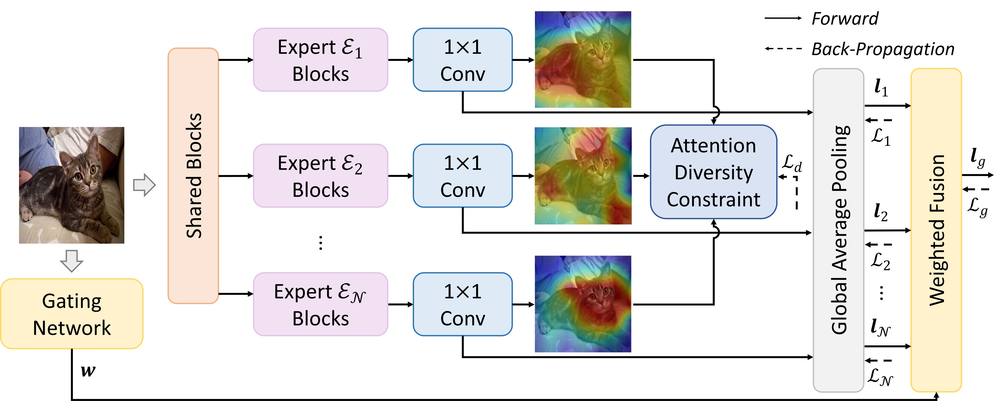
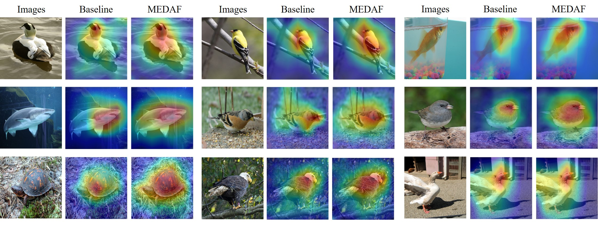

# Exploring Diverse Representations for Open Set Recognition

Official PyTorch Implementation of Our Work *[AAAI2024] Exploring Diverse Representations for Open Set Recognition*. 

[[arXiv](https://arxiv.org/pdf/2401.06521.pdf)]


## A Brief Introduction 👀

Open set recognition (OSR) requires the model to classify samples that belong to closed sets while rejecting unknown samples during test. Currently, generative models often perform better than discriminative models in OSR, but recent studies show that generative models may be computationally infeasible or unstable on complex tasks. In this paper, we provide insights into OSR and find that learning supplementary representations can theoretically reduce the open space risk. Based on the analysis, we propose a new model, namely Multi-Expert Diverse Attention Fusion (MEDAF), that learns diverse representations in a discriminative way. MEDAF consists of multiple experts that are learned with an attention diversity regularization term to ensure the attention maps are mutually different. The logits learned by each expert are adaptively fused and used to identify the unknowns through the score function. We show that the differences in attention maps can lead to diverse representations so that the fused representations can well handle the open space. Extensive experiments are conducted on standard and OSR large-scale benchmarks. Results show that the proposed discriminative method can outperform existing generative models by up to 9.5\% on AUROC and achieve new state-of-the-art performance with little computational cost. Our method can also seamlessly integrate existing classification models.



> Illustration of the proposed MEDAF method. MEDAF consists of a multi-expert feature extractor to explore diverse representations by constraining the learned attention map of each expert to be mutually different. Then a gating network adaptively generates weights to integrate expert-independent predictions.


> Here are some attention comparision of MEDAF and the baseline model.

## Getting Started 🚀
### Environment

- Python 3.10
- Pytorch 1.13.1
- CUDA 11.7
### Requirements
- easydict
- numpy
- Pillow
- PyYAML
- scikit_learn

Or you can directly run the command:
```
pip install -r requirements.txt
```
### Dataset
Before starting the model training, you need to modify the paths of the datasets in `osr_loader.py`. 

Apart from common datasets (CIFAR10, SVHN, CIFAR100), the rest of the datasets need to be manually downloaded and placed in the correct path.

The pre-defined split information is in `misc/util.py`.

### Train
Train from scratch:
```
python osr_main.py -g {GPU_ID} -d {DATASET}
```
Train from checkpoint:
```
python osr_main.py -g {GPU_ID} -d {DATASET} -r -c {CHECKPOINT_PATH}
```

## File organization 📑

The `core` folder contains model, training, and testing code, the `datasets` folder contains data loading and preprocessing code, and the `misc` folder contains other auxiliary code.


## Citation 💡

If you find our code / paper useful in your research, please consider cite our work.
